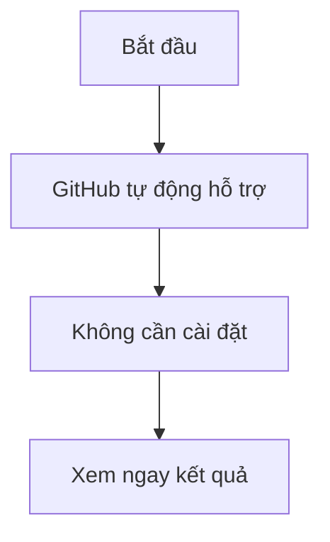

# Mermaid-study

style A fill:#ff4d4d,stroke:#333,stroke-width:2px   %% Đỏ
    style B fill:#4d79ff,stroke:#333,stroke-width:2px   %% Xanh dương
    style C fill:#4dff4d,stroke:#333,stroke-width:2px   %% Xanh lá
    style D fill:#bfbfbf,stroke:#333,stroke-width:2px   %% Xám
